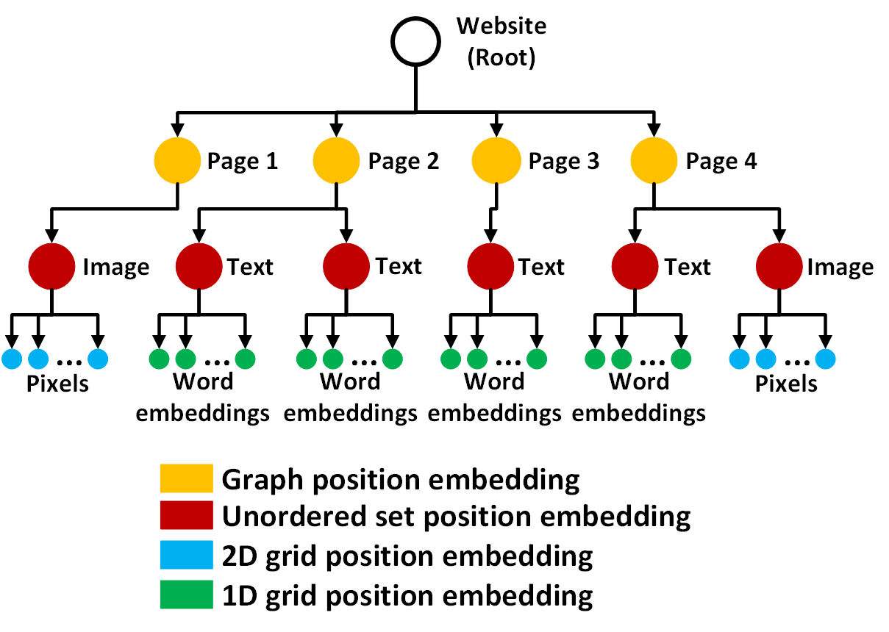
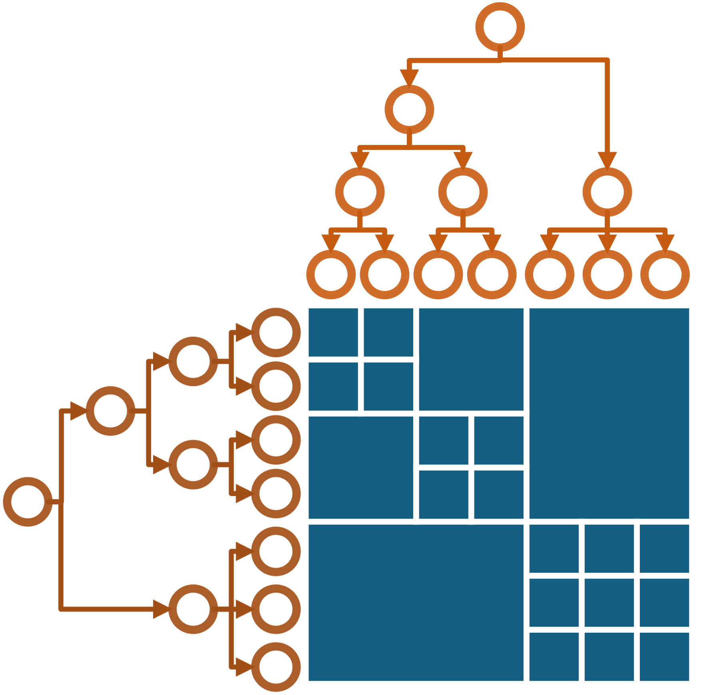
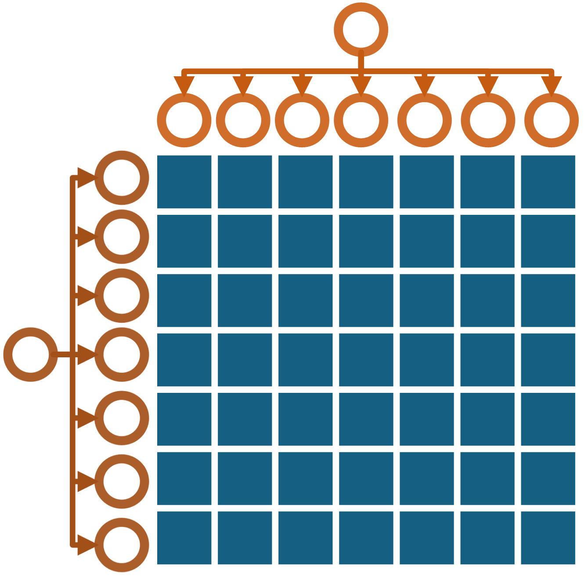
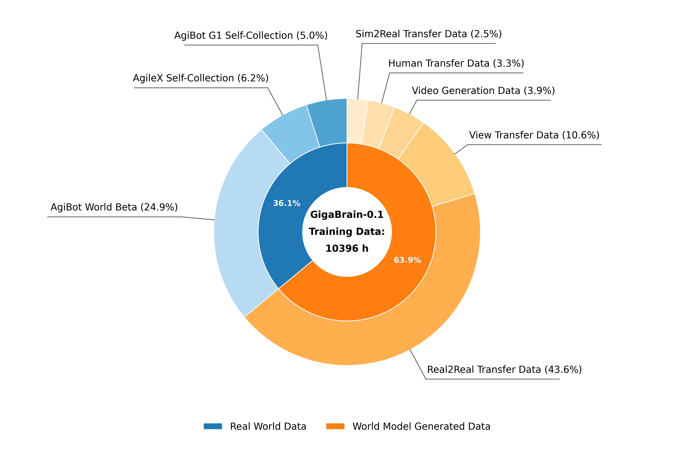
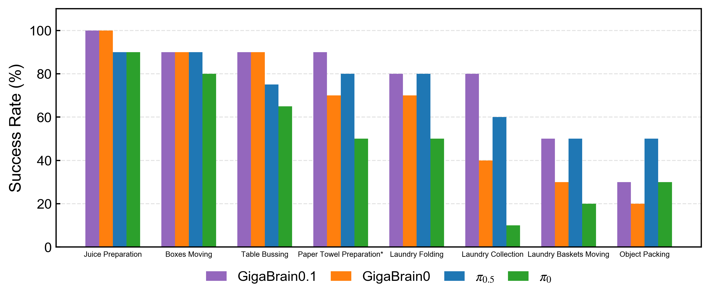
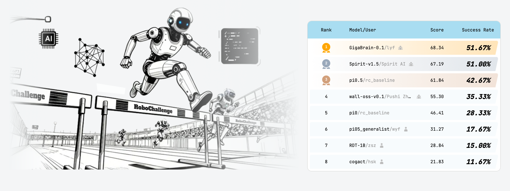
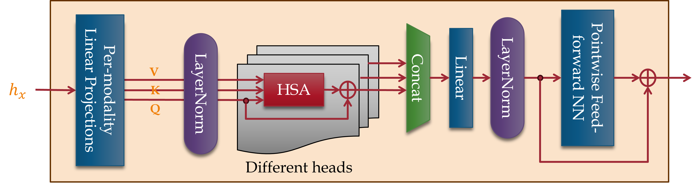

<div align="center" style="font-family: charter;">
    <h1> GigaBrain-0: A World Model-Powered Vision-Language-Action Model </h1>

[](https://opensource.org/licenses/Apache-2.0)
[](https://gigabrain0.github.io/)
[](https://arxiv.org/abs/2510.19430)
[](https://arxiv.org/abs/2509.15448)
[](https://huggingface.co/open-gigaai/models)

</div>

## 📰 News
- **`[2026/03/10]`** Added [Hierarchical Self-Attention (HSA)](https://arxiv.org/abs/2509.15448) (NeurIPS 2025) modules and trainer integration hooks into GigaBrain-0. HSA structures multi-modal tokens into a signal hierarchy, enabling the model to hierarchically focus on task-relevant cameras and spatial regions for improved robot manipulation. See the [HSA section](#-hierarchical-self-attention-hsa) below and [integration plan](docs/hsa_integration_plan.md) for details.

## 🧠 Hierarchical Self-Attention (HSA)

We integrate [**Hierarchical Self-Attention (HSA)**](https://arxiv.org/abs/2509.15448) (Amizadeh et al., NeurIPS 2025) into GigaBrain-0. HSA is a mathematically-derived attention mechanism that generalizes standard Softmax self-attention to multi-modal, multi-scale data by organizing tokens into a *signal hierarchy* tree. Instead of treating all tokens equally, HSA structures them into a tree where the attention matrix is provably the closest (in KL-divergence) to flat Softmax attention while respecting block constraints induced by the hierarchy (Theorem 3.2 in the paper).

**Why HSA for robot manipulation?** GigaBrain-0's Gemma2 decoder processes ~1,000 multi-modal tokens per observation: vision patches from 3 cameras (768 tokens), language instruction tokens (up to 200), and action tokens (50). Standard flat attention computes $O(N^2)$ pairwise weights across all of these indiscriminately. HSA exploits the natural hierarchy in this token sequence — forcing the model to first decide *which modality* matters (language vs. vision vs. action), then *which camera view* contains the target object (overhead vs. left wrist vs. right wrist), and finally *which spatial region* within that camera to attend to. This hierarchical narrowing enables the robot to **"look closer"** at the objects it needs to manipulate, improving both computational efficiency and task-relevant focus.

<div align="center">

<p><i>Signal hierarchy representation from the <a href="https://arxiv.org/abs/2509.15448">HSA paper</a> (Figure 1). A nested signal is represented as a tree where different modalities and scales occupy different branches. Image licensed under <a href="https://creativecommons.org/licenses/by/4.0/">CC BY 4.0</a>.</i></p>
</div>

### Signal Hierarchy for GigaBrain-0

The multi-modal token sequence inside the Gemma2 decoder is organized into the following hierarchy:

```
Root (entire multi-modal observation)
├── Language Group (≤200 tokens)
│   └── lang_token_0, lang_token_1, ..., lang_token_{N-1}
│
├── Vision Group (768 tokens = 3 × 256 SigLIP patches)
│   ├── cam_high (256 patches)        — overhead view
│   ├── cam_left_wrist (256 patches)   — left wrist camera
│   └── cam_right_wrist (256 patches)  — right wrist camera
│
└── Action Group (50 tokens)
    └── action_token_0, action_token_1, ..., action_token_{K-1}
```

| Level | Nodes | What it represents for manipulation |
|-------|-------|-------------------------------------|
| 0 (Root) | 1 | Full multi-modal observation |
| 1 (Modality) | 3 | Language instructions vs. visual observations vs. action context |
| 2 (Sub-modality) | 5 | Individual camera views + language + action as leaf-parent groups |
| 3 (Leaves) | ~1,018 | Fine-grained patch/token-level attention within each group |

### How HSA Helps Robots "Look Closer"

Instead of computing $O(N^2) \approx O(10^6)$ independent attention weights between all token pairs, HSA constrains the attention matrix to be **block-constant** between leaves of sibling nodes. For example, all 256 patches in `cam_high` receive the same attention weight toward all 256 patches in `cam_left_wrist`. This reduces the attention degrees of freedom from $O(N^2)$ to $O(M \cdot b^2)$ where $M \approx 6$ (number of families in the hierarchy) and $b = 3$ (maximum branching factor).

The result: the model first decides "I should focus on the left wrist camera" (level-1/2 attention), then within that camera, refines attention to the specific patches where the target object is located (level-3 attention). This hierarchical narrowing — from modality selection to camera selection to spatial region selection — is what enables the robot to "look closer" at objects of interest.

<div align="center">


<p><i>(Left) HSA attention matrix with block constraint — contiguous tiles represent tied attention weights between token groups. (Right) Standard flat Softmax attention without hierarchy. From the <a href="https://arxiv.org/abs/2509.15448">HSA paper</a>, Figure 2. Images licensed under <a href="https://creativecommons.org/licenses/by/4.0/">CC BY 4.0</a>.</i></p>
</div>

## ✨ Gigabrain Introduction

Training Vision-Language-Action (VLA) models for generalist robots typically requires large-scale real-world robot data, which is expensive and time-consuming to collect. The inefficiency of data collection severely limits the scalability, and generalization capacity of current VLA systems. Therefore, we introduce GigaBrain-0, a novel VLA foundation model empowered by world model-generated data. By leveraging world models to generate diverse data at scale, GigaBrain-0 significantly reduces reliance on real robot data while improving cross-task generalization. Our approach further improves policy robustness through RGBD input modeling and embodied Chain-of-Thought (CoT) supervision, enabling the model to reason about spatial geometry, object states, and long-horizon dependencies during task execution. This leads to substantial gains in real-world performance on dexterous, long-horizon, and mobile manipulation tasks. Extensive experiments demonstrate that GigaBrain-0 achieves superior generalization across variations in appearances (e.g., textures, colors), object placements, and camera viewpoints.


## 💾 Data
GigaBrain-0 was trained using approximately 1k hours of real-world robot data together with a large amount of World Model–generated data. GigaBrain-0.1 scales the training data to 10k hours, with the detailed data composition shown in the figure below.



## 📊 Results

Leveraging the efficient world-model data engine and innovations in model architecture, GigaBrain-0.1 has demonstrated rapid performance improvements. GigaBrain-0.1 outperforms GigaBrain-0 across all real-robot tasks and achieves performance on complex long-horizon tasks comparable to $\pi_{0.5}$.



- Paper Towel Preparation*: Compared to the release with GigaBrain-0, the "Paper Towel Preparation" task has been re-evaluated under a new setting.


## 🤖 RoboChallenge

Using GigaBrain-0.1 to train on RoboChallenge tasks, we achieved 1st place on the leaderboard.




### Integration Architecture

Since `GigaBrain0Policy` is provided by the external `giga-models` package, HSA is integrated via **post-instantiation hook injection** — a lightweight approach that does not modify any model internals:

1. **Hierarchy construction**: `build_gigabrain_hierarchy_meta()` computes the token boundaries and group assignments for the signal hierarchy based on the model's token layout.
2. **Learnable attention bias**: A `HierarchicalAttentionBias` module maintains a learnable 5×5 group bias matrix (zero-initialized) that encodes inter-group attention preferences. This module is added to the model as a submodule, so its parameters participate in optimization, FSDP wrapping, and checkpointing.
3. **Hook registration**: `apply_hsa_bias_hooks()` registers forward pre-hooks on target Gemma2 decoder attention layers. Before each attention computation, the hook expands the group bias into a full $[S, S]$ bias matrix and adds it to the attention mask.

This approach is compatible with `torch.compile`, FSDP distributed training, and activation checkpointing. When HSA is not configured, no hooks are registered and the model behaves identically to the original.

<div align="center">

<p><i>Hierarchical Transformer Encoder (HTE) layer architecture from the <a href="https://arxiv.org/abs/2509.15448">HSA paper</a>, Figure 4. HSA replaces Softmax attention while maintaining the same input/output interface. Image licensed under <a href="https://creativecommons.org/licenses/by/4.0/">CC BY 4.0</a>.</i></p>
</div>

Two HSA components are implemented in [`giga_brain_0/hierarchical_self_attention.py`](giga_brain_0/hierarchical_self_attention.py):

- **`HierarchicalSelfAttention`**: Standalone HSA module implementing the paper's dynamic programming algorithm (Algorithms 1–3) with O(M·b²) complexity.
- **`HierarchicalAttentionBias`**: Learnable block-structured attention bias injectable via hooks — the approach currently used in the trainer.

### HSA Integration Status

| Component | Status |
|-----------|--------|
| Core HSA module (`HierarchicalSelfAttention`) | ✅ Implemented |
| Learnable attention bias (`HierarchicalAttentionBias`) | ✅ Implemented |
| Pre-processor (`HSAPreProcessor`) | ✅ Implemented |
| Hierarchy construction (`build_gigabrain_hierarchy_meta`) | ✅ Implemented |
| Hook registration (`apply_hsa_bias_hooks`) | ✅ Implemented |
| Trainer integration (`_apply_hsa()` in `GigaBrain0Trainer`) | ✅ Implemented |
| Transform `hierarchy_meta` computation | ⬜ Pending |
| Config `hsa_cfg` blocks in training configs | ⬜ Pending |
| End-to-end training benchmarks | ⬜ Pending |

HSA is fully opt-in via the `hsa_cfg` configuration block. When omitted, the training pipeline is completely unaffected. See [`docs/hsa_integration_plan.md`](docs/hsa_integration_plan.md) for the full integration roadmap.

## ⚡ Installation

GigaBrain-0 depends on the following three frameworks:

- [GigaTrain](https://github.com/open-gigaai/giga-train): An Efficient and Scalable Training Framework for AI Models.
- [GigaDatasets](https://github.com/open-gigaai/giga-datasets): A Unified and Lightweight Framework for Data Curation, Evaluation and Visualization.
- [GigaModels](https://github.com/open-gigaai/giga-models): A Comprehensive Repository for Multi-modal, Generative, and Perceptual Models.

We recommend a fresh conda environment.

```bash
conda create -n giga_brain_0 python=3.11.10 -y
conda activate giga_brain_0

pip3 install giga-train
pip3 install giga-datasets
pip3 install lerobot==0.3.2
pip3 install matplotlib
pip3 install numpydantic

git clone https://github.com/open-gigaai/giga-models.git
cd giga-models
pip3 install -e .

git clone https://github.com/open-gigaai/giga-brain-0.git
cd giga-brain-0

```

## 🚀 Quick Start

### 1. Data preparation (LeRobot format) and normalization

To begin, convert your data to the LeRobot format. For reference, see `scripts/convert_from_hdf5.py`, which demonstrates how to convert AgileX data (HDF5 files) to LeRobotDataset.

```bash
python scripts/convert_from_hdf5.py \
  --data-path /path/to/raw_hdf5_data_path \
  --out-dir /path/to/lerobot_dataset \
  --task "Task prompt here"
```

If your dataset is already in LeRobot format, compute normalization stats for `observation.state` and `action` using our script:

```bash

python scripts/compute_norm_stats.py \
  --data-paths /path/to/lerobot_dataset1 /path/to/lerobot_dataset2 \
  --output-path /path/to/norm_stats.json \
  --embodiment-id {embodiment-id} \
  --delta-mask {delta-mask} \
  --sample-rate 1.0 \
  --action-chunk 50 \
  --action-dim 32

```

For AgileX Cobot Magic:

- embodiment_id = 0
- delta_mask = \[True, True, True, True, True, True, False, True, True, True, True, True, True, False\]

For Agibot G1:

- embodiment_id = 1
- delta_mask = \[True, True, True, True, True, True, True, False, True, True, True, True, True, True, True, False, True, True, True, True\]

To support custom robot-type data, you can add a newly initialized action-specific linear and train the newly added linear only and freeze other weights.

Then point your training config to the produced `norm_stats.json` (see examples in `configs`).

### 2. Download GigaBrain-0/0.1 checkpoints from Hugging Face

|         Model         |                                  HF Link                                   |                                                           Description                                                            |
| :-------------------: | :------------------------------------------------------------------------: | :------------------------------------------------------------------------------------------------------------------------------: |
| GigaBrain-0.1-3.5B-Base | 🤗 [Huggingface](https://huggingface.co/open-gigaai/GigaBrain-0.1-3.5B-Base) | More generalizable, more robust, and more powerful. |
| GigaBrain-0-3.5B-Base | 🤗 [Huggingface](https://huggingface.co/open-gigaai/GigaBrain-0-3.5B-Base) | The current release of the model excludes depth images and intermediate 2D manipulation trajectories for more user-friendly use. |


### 3. Training

We provide ready-to-use configs for GigaBrain-0. Adjust `gpu_ids`, `batch_size_per_gpu`, `data_paths`, and `norm_stats_path` as needed.

Logs, configs and checkpoints will be stored at the path `project_dir`

Pre-training:

```bash
python scripts/train.py --config configs.giga_brain_0_from_scratch.config
```

Fine-tuning:

```bash
python scripts/train.py --config configs.giga_brain_0_agilex_finetune.config  # or

python scripts/train.py --config configs.giga_brain_0_agibot_finetune.config
```

Configuration details can be checked in [configure_introduction.md](docs/configure_introduction.md)

### 4. Inference

Run inference on a LeRobot dataset and optionally visualize predictions.

For the same model weights, we provide three different scripts to support different output information.

- Inference continuous action:

  ```bash
  python scripts/inference.py \
    --model-path /path/to/giga_brain_0_checkpoints \
    --data-path /path/to/lerobot_dataset \
    --norm-stats-path /path/to/norm_stats.json \
    --output-path /tmp/vis_path \
    --delta-mask <DELTA_MASK> \
    --embodiment-id <EMBODIMENT_ID> \
    --action-chunk 50 \
    --original-action-dim <ACTION_DIM> \
    --tokenizer-model-path google/paligemma2-3b-pt-224 \
    --fast-tokenizer-path physical-intelligence/fast \
    --device cuda
  ```

- Inference subgoal prediction:

  ```bash
  python scripts/inference_task_planning.py \
    --model-path /path/to/giga_brain_0_checkpoints \
    --data-path /path/to/lerobot_dataset \
    --norm-stats-path /path/to/norm_stats.json \
    --delta-mask <DELTA_MASK> \
    --embodiment-id <EMBODIMENT_ID> \
    --original-action-dim <ACTION_DIM> \
    --tokenizer-model-path google/paligemma2-3b-pt-224 \
    --fast-tokenizer-path physical-intelligence/fast \
    --device cuda
  ```

- Inference discrete action in autoregressive mode (usually for debugging):

  ```bash
  python scripts/inference_discrete_action.py \
    --model-path /path/to/giga_brain_0_checkpoints \
    --data-path /path/to/lerobot_dataset \
    --norm-stats-path /path/to/norm_stats.json \
    --output-path /tmp/vis_path \
    --delta-mask <DELTA_MASK> \
    --embodiment-id <EMBODIMENT_ID> \
    --original-action-dim <ACTION_DIM> \
    --tokenizer-model-path google/paligemma2-3b-pt-224 \
    --fast-tokenizer-path physical-intelligence/fast \
    --device cuda
  ```

### 5. Robot deployment

- Run the server:

  ```bash
  python scripts/inference_server.py \
    --model-path /path/to/giga_brain_0_checkpoints \
    --tokenizer-model-path google/paligemma2-3b-pt-224 \
    --fast-tokenizer-path physical-intelligence/fast \
    --delta-mask <DELTA_MASK> \
    --embodiment-id <EMBODIMENT_ID> \
    --norm-stats-path /path/to/norm_stats.json \
    --original-action-dim <ACTION_DIM> \
    --autoregressive-mode-only False
  ```

- Run the client:

  ```bash
  python scripts/inference_client.py
  ```

This is a minimal client example. It generates random observations to demonstrate the end-to-end request/response flow with the server. You can copy the relevant client code onto your robot and replace the random inputs with real onboard sensor data (e.g., cameras, proprioception) and your robot's control interface. Ensure input shapes and field names remain consistent with the server's expectations.

We also provide an inference client script for AgileX robots: `scripts/inference_agilex_client.py`.

Make sure the host and port are the same in both server and client.

## 📄 License

This project is licensed under the Apache License 2.0 - see the [LICENSE](LICENSE) file for details.

## Citation

```bibtex
@article{gigaai2025gigabrain0,
  title={GigaBrain-0: A World Model-Powered Vision-Language-Action Model},
  author={GigaAI},
  year={2025},
  eprint={2510.19430},
  archivePrefix={arXiv},
  primaryClass={cs.CV},
  url={https://arxiv.org/abs/2510.19430},
}
```

If you use the Hierarchical Self-Attention feature, please also cite:

```bibtex
@inproceedings{amizadeh2025hierarchical,
  title={Hierarchical Self-Attention: Generalizing Neural Attention Mechanics to Multi-Scale Problems},
  author={Amizadeh, Saeed and Abdali, Sara and Li, Yinheng and Koishida, Kazuhito},
  booktitle={The Thirty-Ninth Annual Conference on Neural Information Processing Systems (NeurIPS 2025)},
  year={2025},
  eprint={2509.15448},
  archivePrefix={arXiv},
  primaryClass={cs.LG},
  url={https://arxiv.org/abs/2509.15448},
}
```
