# GigaBrain-0 Codebase Overview

## Description

**GigaBrain-0** is a Vision-Language-Action (VLA) foundation model for robotic manipulation, powered by world model-generated data. It combines a SigLIP-based vision encoder (PaliGemma2) with a Gemma2 language decoder (MoE architecture) and a diffusion-based action decoder. The system supports multiple robot embodiments (AgileX Cobot Magic, Agibot G1, Agibot World) and produces continuous actions via diffusion, discrete actions via autoregression, or subtask predictions for long-horizon planning.

The codebase provides an end-to-end pipeline from raw HDF5 robot data through training to real-time robot deployment, including a client-server inference architecture and ROS-integrated hardware control.

---

## Pipeline Diagram

```mermaid
flowchart TD
    subgraph DATA_CONVERSION["Stage 1: Data Conversion"]
        HDF5["Raw HDF5 Robot Data<br/>(images, joint positions, actions)"]
        CONVERT["scripts/convert_from_hdf5.py<br/>- Reads HDF5 episodes<br/>- 3 cameras: high, left_wrist, right_wrist<br/>- 14 joints + 2 base actions<br/>- Supports compressed/uncompressed images"]
        LEROBOT["LeRobot Dataset v2.1<br/>(Structured format with metadata)"]
        HDF5 --> CONVERT --> LEROBOT
    end

    subgraph NORM_STATS["Stage 2: Normalization Statistics"]
        NS_SCRIPT["scripts/compute_norm_stats.py<br/>- Online mean/std/quantile computation<br/>- Per-embodiment statistics<br/>- Applies DeltaActions + Padding transforms"]
        NS_JSON["norm_stats.json (per embodiment)<br/>- observation.state: mean, std, q01, q99<br/>- action: mean, std, q01, q99"]
        LEROBOT --> NS_SCRIPT --> NS_JSON
    end

    subgraph TRANSFORMS["Stage 3: Data Transforms"]
        direction TB
        TRANSFORMS_MAIN["giga_brain_0/giga_brain_0_transforms.py<br/>(GigaBrain0Transform)"]
        T1["1. DeltaActions<br/>- Converts absolute → delta actions<br/>- Per-embodiment binary masks"]
        T2["2. State Normalization<br/>- Per-embodiment norm using mean/std or q01/q99"]
        T3["3. Action Normalization<br/>- Maps to [-1, 1] range"]
        T4["4. Image Transform<br/>- Resize to 224×224 with padding<br/>- Optional augmentation (train only)<br/>- Optional depth (4th channel)<br/>- 3 camera views"]
        T5["5. Prompt Tokenization<br/>- PaliGemma2 + FastTokenizer<br/>- 5 sampling modes with configurable ratios<br/>- Outputs: lang_tokens, lang_masks, lang_att_masks,<br/>  lang_loss_masks, fast_action_indicator"]
        T6["6. Padding<br/>- Pad state/action to 32 dims<br/>- Create padding masks"]
        T7["7. Trajectory Transform (optional)<br/>- 2D trajectory prediction targets"]
        TRANSFORMS_MAIN --> T1 --> T2 --> T3 --> T4 --> T5 --> T6 --> T7
    end

    subgraph TRAINING_CONFIG["Stage 4: Training Configuration"]
        CFG_SCRATCH["configs/giga_brain_0_from_scratch.py<br/>- 250K steps, multi-embodiment (0,1,2)<br/>- Pretrained: GigaBrain-0-3.5B-Base<br/>- 3 active sampling modes:<br/>  subtask_regression (20%), fast_regression (40%),<br/>  subtask+fast_regression (40%)<br/>- 8 GPUs, FSDP, batch_size=32/GPU"]
        CFG_AGILEX["configs/giga_brain_0_agilex_finetune.py<br/>- 50K steps, finetune from GigaBrain-0-3.5B-Base<br/>- Embodiment 0 (AgileX) only<br/>- 100% task_only mode"]
        CFG_AGIBOT["configs/giga_brain_0_agibot_finetune.py<br/>- 50K steps, finetune from GigaBrain-0-3.5B-Base<br/>- Embodiment 1 (Agibot G1) only<br/>- 100% task_only mode"]
    end

    subgraph TRAINING["Stage 5: Training Pipeline"]
        TRAIN_ENTRY["scripts/train.py<br/>- CLI entry point<br/>- Calls launch_from_config()"]
        TRAINER["giga_brain_0/giga_brain_0_trainer.py<br/>(GigaBrain0Trainer)<br/>- Loads GigaBrain0Policy (pretrained or scratch)<br/>- Optional PaliGemma weight conversion<br/>- EMA support, activation checkpointing<br/>- torch.compile with inductor backend"]
        FWD["forward_step():<br/>1. Sample timestep t ~ Beta(1.5, 1.0)<br/>2. Sample noise ε ~ N(0,1)<br/>3. Create x_t = t·ε + (1-t)·action<br/>4. Model predicts v_t from (x_t, t, images, tokens)<br/>5. Compute target u_t = ε - action"]
        LOSS["giga_brain_0/giga_brain_0_loss.py<br/>(GigaBrain0Loss)<br/>- Diffusion Loss: MSE(u_t, v_t) × action_mask<br/>- LLM Loss: CrossEntropy(logits, tokens) × lang_mask<br/>- Trajectory Loss: MSE(pred, gt) × traj_mask"]
        OPTIM["Optimization:<br/>- AdamW (lr=2.5e-5, wd=1e-10)<br/>- Cosine decay with warmup<br/>- Checkpoint every 1000 steps<br/>- TensorBoard logging"]
        CKPT["Saved Checkpoints"]

        TRAIN_ENTRY --> TRAINER --> FWD --> LOSS --> OPTIM --> CKPT
    end

    subgraph INFERENCE["Stage 6: Inference Pipeline"]
        INF_DIFF["scripts/inference.py<br/>(Mode A: Continuous Diffusion)<br/>- Diffusion denoising via GigaBrain0Pipeline<br/>- Denormalize + delta→absolute<br/>- Optional 2D trajectory output<br/>- Visualization: pred vs GT plots"]
        INF_DISC["scripts/inference_discrete_action.py<br/>(Mode B: Discrete Autoregression)<br/>- Token-by-token generation<br/>- FastTokenizer decoding<br/>- No torch.compile"]
        INF_PLAN["scripts/inference_task_planning.py<br/>(Mode C: Subtask Prediction)<br/>- predict_current_subtask()<br/>- Predicts current subtask from images<br/>- Compares with GT subtask"]
        INF_SRV["scripts/inference_server.py<br/>(Mode D: Server)<br/>- ZMQ-based inference server<br/>- Supports diffusion + autoregressive<br/>- Hot-reload, health check, shutdown"]
        INF_CLI["scripts/inference_client.py<br/>(Mode D: Client)<br/>- ZMQ client with TorchSerializer<br/>- Sends observation, receives action"]
        INF_AGI["scripts/inference_agilex_client.py<br/>(Mode E: AgileX Robot Deployment)<br/>- Full ROS integration (topics/subscribers)<br/>- Frame synchronization<br/>- Temporal aggregation<br/>- Joint limit enforcement<br/>- Real-time closed-loop control"]
    end

    NS_JSON --> TRANSFORMS
    LEROBOT --> TRANSFORMS
    TRANSFORMS --> TRAINING
    TRAINING_CONFIG --> TRAINING
    CKPT --> INFERENCE

    style DATA_CONVERSION fill:#e1f5fe
    style NORM_STATS fill:#e8f5e9
    style TRANSFORMS fill:#fff3e0
    style TRAINING_CONFIG fill:#f3e5f5
    style TRAINING fill:#fce4ec
    style INFERENCE fill:#e0f2f1
```

---

## Embodiment Configuration

| Embodiment ID | Robot | State Dim | Action Dim | Notes |
|---|---|---|---|---|
| 0 | AgileX Cobot Magic | 14 (7L + 7R) | 14 + 2 base = 16 | Delta mask freezes gripper dims |
| 1 | Agibot G1 | 20 (10L + 10R) | 20 + 2 base = 22 | Delta mask per joint group |
| 2 | Agibot World | 20 | 20+ | Similar to G1, mobile manipulation |

## Key External Dependencies

- **giga-models**: Provides `GigaBrain0Policy` and `GigaBrain0Pipeline` (model architecture)
- **giga-train**: Provides `Trainer` base class and `launch_from_config()` (training framework)
- **giga-datasets**: Provides `LeRobotDataset`, `FastLeRobotDataset` (data loading)
- **physical-intelligence/fast**: Provides `FastTokenizer` for discrete action encoding
- **PaliGemma2**: Vision-language backbone (SigLIP encoder + Gemma2 decoder)
