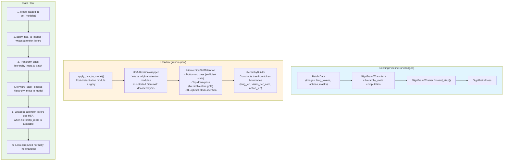
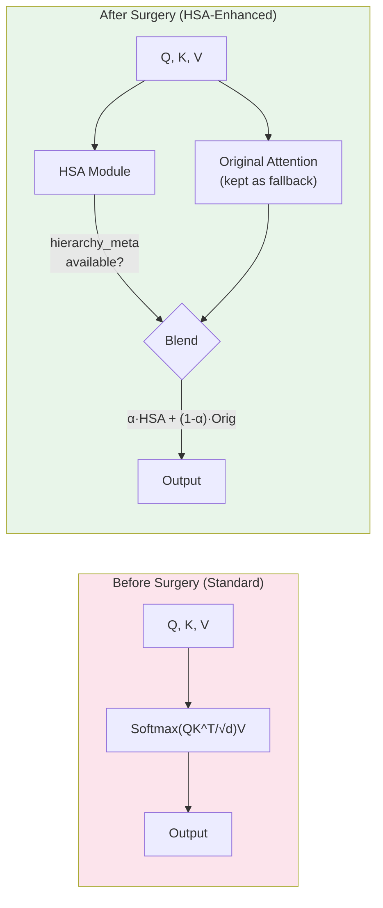
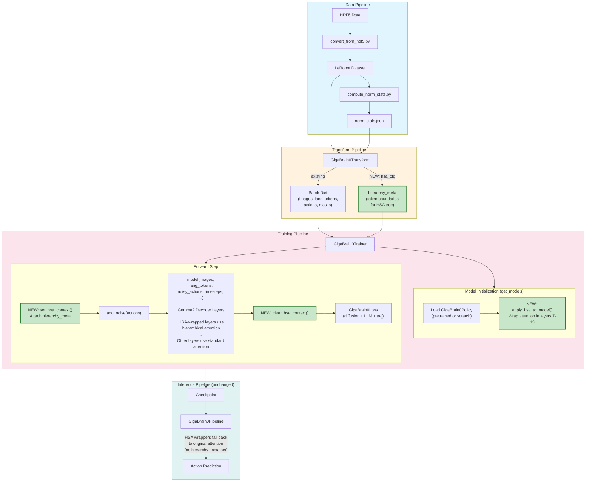

# HSA Integration Plan for GigaBrain-0

## 1. Executive Summary

This plan integrates **Hierarchical Self-Attention (HSA)** from arXiv 2509.15448 into the GigaBrain-0 VLA codebase. Because the core model (`GigaBrain0Policy` from `giga_models`) is an external, non-modifiable dependency, the integration uses **post-instantiation module surgery** — a standard technique used by PEFT/LoRA — to replace standard Softmax attention in selected Gemma2 decoder layers with HSA attention after the model is loaded.

**Core idea**: The multi-modal token sequence in each Gemma2 decoder layer (language + vision + action tokens) has natural hierarchical structure. HSA exploits this structure by constraining attention weights to be block-constant at each level of the hierarchy, forcing the model to first decide *which modality/camera* to attend to, then *which specific token* within that group. This narrows focus to task-relevant objects and regions.

---

## 2. Signal Hierarchy Definition

The token sequence inside the Gemma2 decoder has this natural tree structure:

```
Root (entire multi-modal sequence)
├── Language Group
│   └── lang_token_0, lang_token_1, ..., lang_token_{N_lang-1}
│
├── Vision Group
│   ├── cam_high (256 SigLIP patches)
│   │   └── patch_0, patch_1, ..., patch_255
│   ├── cam_left_wrist (256 SigLIP patches)
│   │   └── patch_0, patch_1, ..., patch_255
│   └── cam_right_wrist (256 SigLIP patches)
│       └── patch_0, patch_1, ..., patch_255
│
└── Action/Diffusion Group
    └── action_token_0, action_token_1, ..., action_token_{N_act-1}
```

**Tree properties:**
| Level | Nodes | Description |
|-------|-------|-------------|
| 0 (Root) | 1 node | Full multi-modal observation |
| 1 (Modality) | 3 nodes | Language, Vision, Action |
| 2 (Sub-modality) | 5 nodes | Language (leaf-parent), cam_high, cam_left_wrist, cam_right_wrist, Action (leaf-parent) |
| 3 (Leaves) | ~N tokens | Individual tokens (lang ≤200, vision = 3×256 = 768, action = variable) |

**Why this hierarchy makes sense for manipulation:**
- **Level 1** (modality selection): The model first decides the relative importance of language instructions vs. visual observations vs. current action context
- **Level 2** (camera selection): Within vision, the model selects which camera view contains task-relevant objects (e.g., wrist cameras for grasping, high camera for navigation)
- **Level 3** (token-level): Fine-grained attention to specific spatial regions or tokens

**Efficiency gain**: With ~1000 total tokens, standard attention is O(1000²) = O(10⁶). HSA with this hierarchy: M ≈ 6 families, max branching b = 3 → O(6 × 9) = O(54) per query for the hierarchical part, plus leaf-level computation.

---

## 3. Integration Strategy: Module Surgery

### Why Module Surgery?

Since `giga_models` is external and unmodifiable, we cannot change the attention implementation inside `GigaBrain0Policy` directly. Instead, we use **post-instantiation module surgery**:

1. Load `GigaBrain0Policy` normally (pretrained or from scratch)
2. Traverse `model.named_modules()` to locate Gemma2 decoder attention layers
3. Wrap the attention modules in selected layers with HSA-enhanced versions
4. The wrapper delegates to the original attention by default, and overlays HSA structure

This pattern is identical to how LoRA, QLoRA, and adapter methods inject into frozen models.

### Layer Selection Strategy

Not all layers need HSA. Based on the paper's finding that HSA can be injected zero-shot into select layers:

- **Early layers (0-25%)**: Keep standard attention — these handle low-level feature mixing
- **Middle layers (25-75%)**: Apply HSA — these perform cross-modal reasoning and object grounding
- **Late layers (75-100%)**: Configurable — may benefit from HSA for action-relevant focus

The specific layers are configurable via `hsa_cfg.target_layers` in the training config.

---

## 4. Integration Architecture Diagram



### Detailed Attention Layer Replacement Diagram



---

## 5. Files to Create / Modify

### Overview Table

| File | Action | Purpose |
|------|--------|---------|
| `giga_brain_0/hierarchical_self_attention.py` | **CREATE** | Core HSA algorithm + wrapper + surgery utility |
| `giga_brain_0/giga_brain_0_trainer.py` | **MODIFY** | Apply HSA to model after loading, pass hierarchy_meta |
| `giga_brain_0/giga_brain_0_transforms.py` | **MODIFY** | Compute and attach hierarchy_meta to batch |
| `giga_brain_0/__init__.py` | **MODIFY** | Export new HSA module |
| `configs/giga_brain_0_from_scratch.py` | **MODIFY** | Add `hsa_cfg` configuration block |
| `configs/giga_brain_0_agilex_finetune.py` | **MODIFY** | Add `hsa_cfg` configuration block |
| `configs/giga_brain_0_agibot_finetune.py` | **MODIFY** | Add `hsa_cfg` configuration block |

---

## 6. Detailed Implementation Plan

---

### 6.1 NEW: `giga_brain_0/hierarchical_self_attention.py`

This is the core implementation file. It contains four components:

#### 6.1.1 `HierarchyNode` (dataclass)

A tree node representing one level of the signal hierarchy.

```python
@dataclasses.dataclass
class HierarchyNode:
    """A node in the signal hierarchy tree."""
    children: list['HierarchyNode']   # child nodes (empty for leaves)
    token_start: int                   # start index in the flat token sequence
    token_end: int                     # end index (exclusive)
    name: str = ''                     # human-readable label (e.g., 'cam_high')

    @property
    def num_leaves(self) -> int:
        return self.token_end - self.token_start

    @property
    def is_leaf(self) -> bool:
        return len(self.children) == 0
```

#### 6.1.2 `build_hierarchy(hierarchy_meta) -> HierarchyNode`

Constructs the tree from token boundary metadata.

**Input**: `hierarchy_meta` dict with keys:
- `lang_start`, `lang_end`: language token boundaries
- `vision_starts`, `vision_ends`: list of 3 (start, end) pairs for each camera
- `action_start`, `action_end`: action token boundaries

**Output**: Root `HierarchyNode` with the tree structure defined in Section 2.

```python
def build_hierarchy(hierarchy_meta: dict[str, int | list]) -> HierarchyNode:
    """Build the signal hierarchy tree from token boundary metadata.

    Args:
        hierarchy_meta: Dictionary containing token range boundaries for each
            modality group. Keys: lang_start, lang_end, vision_starts,
            vision_ends, action_start, action_end.

    Returns:
        Root HierarchyNode of the constructed tree.
    """
    lang_node = HierarchyNode(
        children=[], token_start=hierarchy_meta['lang_start'],
        token_end=hierarchy_meta['lang_end'], name='language'
    )

    cam_nodes = []
    cam_names = ['cam_high', 'cam_left_wrist', 'cam_right_wrist']
    for i, name in enumerate(cam_names):
        cam_nodes.append(HierarchyNode(
            children=[], token_start=hierarchy_meta['vision_starts'][i],
            token_end=hierarchy_meta['vision_ends'][i], name=name
        ))
    vision_node = HierarchyNode(
        children=cam_nodes,
        token_start=hierarchy_meta['vision_starts'][0],
        token_end=hierarchy_meta['vision_ends'][-1],
        name='vision'
    )

    action_node = HierarchyNode(
        children=[], token_start=hierarchy_meta['action_start'],
        token_end=hierarchy_meta['action_end'], name='action'
    )

    root = HierarchyNode(
        children=[lang_node, vision_node, action_node],
        token_start=0,
        token_end=hierarchy_meta['action_end'],
        name='root'
    )
    return root
```

#### 6.1.3 `HierarchicalSelfAttention(nn.Module)` — Core HSA Algorithm

Implements Algorithms 2 and 3 from arXiv 2509.15448.

```python
class HierarchicalSelfAttention(nn.Module):
    """Hierarchical Self-Attention (HSA) algorithm.

    Computes the KL-optimal hierarchical approximation of standard Softmax
    attention given a tree structure over tokens. Uses dynamic programming
    with bottom-up and top-down passes.

    Args:
        d_model: Dimension of the model (for scaling).
        temperature: Softmax temperature. Defaults to 1.0.
    """
```

**Key methods:**

**`_bottom_up(Q, K, root) -> dict`** — Algorithm 2
- Traverses tree leaves-to-root
- For each internal node `v` with children `c_1, ..., c_b`:
  - `rho_q[v]` = mean of `rho_q[c_i]` (average query for the subtree)
  - `rho_k[v]` = mean of `rho_k[c_i]` (average key for the subtree)
  - `eta[v]` = `b × b` matrix where `eta[v][i,j] = rho_q[c_i]^T · rho_k[c_j] / sqrt(d)`
  - `phi[v]` = partition energy computed from `eta[v]`
- For leaf nodes: `rho_q = Q[token_start:token_end]`, `rho_k = K[token_start:token_end]`
- Returns dict mapping each node to its sufficient statistics

**`_top_down(root, stats, V) -> Tensor`** — Algorithm 3
- Traverses tree root-to-leaves
- At each internal node, computes block attention weights from parent accumulation + local `eta`
- At leaves, computes the final weighted sum using hierarchical weights × V
- Returns the attention output tensor (same shape as Q)

**`forward(Q, K, V, hierarchy) -> Tensor`**
- Calls `_bottom_up` then `_top_down`
- Returns the HSA attention output

**Computational complexity:**
- Bottom-up: O(M · b²) where M = number of families ≈ 6, b = max branching = 3
- Top-down: O(M · b²) + O(N) for leaf-level V weighting
- Total: O(N) + O(M · b²), linear in sequence length for fixed hierarchy

#### 6.1.4 `HSAAttentionWrapper(nn.Module)` — Drop-in Wrapper

Wraps an existing attention module, blending HSA output with the original.

```python
class HSAAttentionWrapper(nn.Module):
    """Wraps an existing attention module to blend HSA with original attention.

    When hierarchy_meta is provided in the forward pass (via a thread-local
    or module-level context), computes HSA attention and blends it with the
    original output using a learnable mixing coefficient alpha.

    When hierarchy_meta is not provided, falls back to the original attention
    unchanged (for inference without HSA).

    Args:
        original_attention: The original attention module being wrapped.
        d_model: Model dimension.
        num_heads: Number of attention heads.
        hsa_alpha_init: Initial value for the blending coefficient (0 = pure
            original, 1 = pure HSA). Default 0.0 for safe initialization.
    """
```

**Key design decisions:**
- **Learnable `alpha`**: A per-layer scalar (sigmoid-initialized to `hsa_alpha_init`) that blends `alpha * HSA_output + (1 - alpha) * original_output`. Starting at 0.0 means the model begins with original attention and gradually learns to incorporate HSA.
- **Context passing**: Uses a module-level attribute `_hsa_hierarchy_meta` set before each forward pass (set by the trainer, cleared after). This avoids changing any function signatures.
- **Graceful fallback**: If no hierarchy_meta is set (e.g., during standard inference), the wrapper is a no-op passthrough.

```python
def forward(self, *args, **kwargs):
    # Always compute original attention
    original_output = self.original_attention(*args, **kwargs)

    # Check if HSA context is available
    hierarchy_meta = getattr(self, '_hsa_hierarchy_meta', None)
    if hierarchy_meta is None or not self.enabled:
        return original_output

    # Extract Q, K, V from original module's cached projections
    # (implementation depends on Gemma2 attention interface)
    Q, K, V = self._extract_qkv(*args, **kwargs)
    hierarchy = build_hierarchy(hierarchy_meta)

    # Compute HSA per head
    hsa_output = self._multi_head_hsa(Q, K, V, hierarchy)

    # Blend
    alpha = torch.sigmoid(self.alpha)
    blended = alpha * hsa_output + (1 - alpha) * original_output
    return blended
```

#### 6.1.5 `apply_hsa_to_model(model, hsa_cfg) -> model`

The module surgery function.

```python
def apply_hsa_to_model(
    model: torch.nn.Module,
    hsa_cfg: dict,
) -> torch.nn.Module:
    """Apply HSA to a pre-trained model via module surgery.

    Traverses the model's module tree, identifies attention layers in the
    specified target layers, and wraps them with HSAAttentionWrapper.

    Args:
        model: The GigaBrain0Policy model instance.
        hsa_cfg: Configuration dict with keys:
            - target_layers: list[int] or 'all' — which decoder layers to wrap
            - d_model: int — model hidden dimension
            - num_heads: int — number of attention heads
            - hsa_alpha_init: float — initial blending coefficient
            - attention_module_name: str — name pattern to match attention
              modules (default: 'self_attn')

    Returns:
        The model with HSA wrappers applied (in-place modification).
    """
```

**Implementation strategy:**
1. Iterate `model.named_modules()` to find decoder layers matching pattern `*decoder*layer*{i}*` for each `i` in `target_layers`
2. Within each matched decoder layer, find the attention sub-module (matching `attention_module_name`)
3. Replace it with `HSAAttentionWrapper(original_attn, ...)`
4. Return the model (modified in-place)

```python
def apply_hsa_to_model(model, hsa_cfg):
    if not hsa_cfg.get('enable', False):
        return model

    target_layers = hsa_cfg.get('target_layers', [])
    d_model = hsa_cfg.get('d_model', 2048)
    num_heads = hsa_cfg.get('num_heads', 8)
    alpha_init = hsa_cfg.get('hsa_alpha_init', 0.0)
    attn_name = hsa_cfg.get('attention_module_name', 'self_attn')

    wrapped_count = 0
    for name, module in model.named_modules():
        # Match Gemma2 decoder layers by index
        for layer_idx in target_layers:
            pattern = f'layers.{layer_idx}.'
            if pattern in name and name.endswith(attn_name):
                parent_name = name.rsplit('.', 1)[0]
                parent = dict(model.named_modules())[parent_name]
                wrapper = HSAAttentionWrapper(
                    original_attention=module,
                    d_model=d_model,
                    num_heads=num_heads,
                    hsa_alpha_init=alpha_init,
                )
                setattr(parent, attn_name, wrapper)
                wrapped_count += 1

    print(f'[HSA] Wrapped {wrapped_count} attention layers with HSA')
    return model
```

#### 6.1.6 `set_hsa_context(model, hierarchy_meta)` / `clear_hsa_context(model)` — Context Utilities

```python
def set_hsa_context(model: torch.nn.Module, hierarchy_meta: dict | None):
    """Set hierarchy metadata on all HSAAttentionWrapper modules."""
    for module in model.modules():
        if isinstance(module, HSAAttentionWrapper):
            module._hsa_hierarchy_meta = hierarchy_meta

def clear_hsa_context(model: torch.nn.Module):
    """Clear hierarchy metadata from all HSAAttentionWrapper modules."""
    set_hsa_context(model, None)
```

---

### 6.2 MODIFY: `giga_brain_0/giga_brain_0_trainer.py`

#### Change 1: Import HSA utilities

```python
# Add at top of file:
from .hierarchical_self_attention import apply_hsa_to_model, set_hsa_context, clear_hsa_context
```

#### Change 2: Apply HSA in `get_models()`

After the model is loaded and before `giga_brain_0.to(self.device)`, add HSA wrapping:

```python
# In get_models(), after model is fully initialized and before .to(self.device):

# Apply HSA if configured
hsa_cfg = getattr(model_config, 'hsa_cfg', None) if hasattr(model_config, 'hsa_cfg') else model_config.get('hsa_cfg', None)
if hsa_cfg is not None:
    giga_brain_0 = apply_hsa_to_model(giga_brain_0, hsa_cfg)
    self._hsa_enabled = True
else:
    self._hsa_enabled = False
```

**Where exactly in `get_models()`:** Between model construction completion and `giga_brain_0.to(self.device)`. Both code paths (pretrained and from-scratch) converge before the `.to()` call, so we insert HSA application there.

#### Change 3: Modify `forward_step()` to pass hierarchy_meta

```python
def forward_step(self, batch_dict: dict[str, torch.Tensor]) -> dict[str, torch.Tensor]:
    # ... existing extraction of images, lang_tokens, etc. ...

    # Set HSA context if enabled
    if getattr(self, '_hsa_enabled', False) and 'hierarchy_meta' in batch_dict:
        set_hsa_context(self.model, batch_dict['hierarchy_meta'])

    noisy_model_input, timesteps = self.loss_func.add_noise(actions)
    model_pred = self.model(
        images, img_masks, lang_tokens, lang_masks,
        noisy_model_input, timesteps, emb_ids,
        lang_att_masks=lang_att_masks,
        fast_action_indicator=fast_action_indicator,
    )

    # Clear HSA context
    if getattr(self, '_hsa_enabled', False):
        clear_hsa_context(self.model)

    loss = self.loss_func(model_pred, lang_tokens, lang_loss_masks, action_loss_mask, traj, traj_loss_mask)
    return loss
```

**Key principle**: The actual `self.model(...)` call signature does NOT change. HSA operates inside the wrapped attention layers, reading hierarchy_meta from the module-level context attribute. This ensures zero breakage in the external API.

---

### 6.3 MODIFY: `giga_brain_0/giga_brain_0_transforms.py`

#### Change: Add `hsa_cfg` param and `_compute_hierarchy_meta` method

Add a new optional parameter `hsa_cfg` to `GigaBrain0Transform.__init__`:

```python
def __init__(
    self,
    delta_action_cfg=None,
    norm_cfg=None,
    traj_cfg=None,
    image_cfg=None,
    prompt_cfg=None,
    is_train=True,
    hsa_cfg=None,        # NEW: optional HSA configuration
):
    # ... existing init ...
    self.hsa_enabled = hsa_cfg is not None and hsa_cfg.get('enable', False)
    if self.hsa_enabled:
        self.num_vision_patches_per_cam = hsa_cfg.get('num_vision_patches_per_cam', 256)
        self.cam_names = hsa_cfg.get('cam_names', ['cam_high', 'cam_left_wrist', 'cam_right_wrist'])
```

Add a method that computes token boundaries at the end of `__call__`:

```python
# At end of __call__, before return:
if self.hsa_enabled:
    output_dict['hierarchy_meta'] = self._compute_hierarchy_meta(output_dict)
```

The `_compute_hierarchy_meta` method:

```python
def _compute_hierarchy_meta(self, output_dict: dict) -> dict:
    """Compute token boundary positions for HSA hierarchy construction.

    Computes the start/end indices of each modality group in the
    concatenated token sequence used by the Gemma2 decoder.

    Token layout (PaliGemma2 convention):
        [vision_patches_cam0 | vision_patches_cam1 | vision_patches_cam2 |
         lang_tokens | action/diffusion_tokens]

    Args:
        output_dict: The transformed batch dictionary containing token data.

    Returns:
        Dictionary with token range metadata for hierarchy construction.
    """
    n_cams = len(self.cam_names)
    patches_per_cam = self.num_vision_patches_per_cam
    lang_len = int(output_dict['lang_masks'].sum().item())

    # Vision tokens come first in PaliGemma2
    vision_starts = []
    vision_ends = []
    for i in range(n_cams):
        start = i * patches_per_cam
        end = start + patches_per_cam
        vision_starts.append(start)
        vision_ends.append(end)

    # Language tokens follow vision
    lang_start = n_cams * patches_per_cam
    lang_end = lang_start + lang_len

    # Action/diffusion tokens follow language
    action_start = lang_end
    action_len = output_dict['action'].shape[0]  # chunk_size
    action_end = action_start + action_len

    return {
        'lang_start': lang_start,
        'lang_end': lang_end,
        'vision_starts': vision_starts,
        'vision_ends': vision_ends,
        'action_start': action_start,
        'action_end': action_end,
    }
```

> **Important note**: The exact token ordering (vision-first vs. language-first) depends on the PaliGemma2 implementation inside `giga_models`. The actual indices must be verified by inspecting `GigaBrain0Policy`'s forward pass. The `_compute_hierarchy_meta` method should be calibrated during implementation by running a debug forward pass and checking tensor shapes. The hierarchy_meta dictionary structure is designed to allow easy adjustment of offsets.

---

### 6.4 MODIFY: `giga_brain_0/__init__.py`

Add export for the new module:

```python
from .giga_brain_0_trainer import GigaBrain0Trainer
from .giga_brain_0_transforms import GigaBrain0Transform
from .hierarchical_self_attention import (     # NEW
    HierarchicalSelfAttention,
    apply_hsa_to_model,
)
```

---

### 6.5 MODIFY: Config files

#### `configs/giga_brain_0_from_scratch.py`

Add `hsa_cfg` to the `models` dict and corresponding `hsa_cfg` to the transform:

```python
config = dict(
    # ... existing config ...
    dataloaders=dict(
        train=dict(
            # ... existing ...
            transform=dict(
                # ... existing params ...
                hsa_cfg=dict(                          # NEW
                    enable=True,
                    num_vision_patches_per_cam=256,     # (224/14)^2 = 256 SigLIP patches
                    cam_names=['cam_high', 'cam_left_wrist', 'cam_right_wrist'],
                ),
            ),
        ),
    ),
    models=dict(
        # ... existing params ...
        hsa_cfg=dict(                                  # NEW
            enable=True,
            target_layers=[7, 8, 9, 10, 11, 12, 13],  # Middle layers of Gemma2 (26 total)
            d_model=2048,                               # Gemma2 hidden dim
            num_heads=8,                                # Gemma2 attention heads
            hsa_alpha_init=0.0,                         # Start with pure original attention
            attention_module_name='self_attn',          # Gemma2 attention module name
        ),
    ),
    # ... rest of config ...
)
```

#### `configs/giga_brain_0_agilex_finetune.py` and `giga_brain_0_agibot_finetune.py`

Same pattern — add `hsa_cfg` blocks. For finetune configs, you may want `hsa_alpha_init=0.0` (conservative) and fewer `target_layers` for stability:

```python
hsa_cfg=dict(
    enable=True,                             # Set to False to disable
    target_layers=[8, 9, 10, 11, 12],        # Fewer layers for finetune
    d_model=2048,
    num_heads=8,
    hsa_alpha_init=0.0,
    attention_module_name='self_attn',
),
```

> **Toggle**: Setting `enable=False` in any config disables HSA entirely, yielding the original pipeline behavior with zero overhead.

---

## 7. HSA Algorithm Pseudocode (for implementation reference)

### Algorithm 2: Bottom-Up Pass

```
function BOTTOM_UP(Q, K, root):
    stats = {}
    for v in POST_ORDER(root):                    # leaves first, root last
        if v.is_leaf:
            stats[v].rho_q = mean(Q[v.start:v.end], dim=0)    # [d]
            stats[v].rho_k = mean(K[v.start:v.end], dim=0)    # [d]
        else:
            children = v.children                              # [c_1, ..., c_b]
            b = len(children)
            stats[v].rho_q = mean([stats[c].rho_q for c in children])
            stats[v].rho_k = mean([stats[c].rho_k for c in children])

            # Interaction energy matrix
            eta = zeros(b, b)
            for i in range(b):
                for j in range(b):
                    eta[i,j] = dot(stats[children[i]].rho_q,
                                   stats[children[j]].rho_k) / sqrt(d)
            stats[v].eta = eta

            # Node energy (log-partition)
            stats[v].phi = logsumexp(eta, dim=-1)  # [b]

    return stats
```

### Algorithm 3: Top-Down Pass

```
function TOP_DOWN(root, stats, V):
    output = zeros_like(V)
    accumulator = {}                               # maps node -> accumulated log-weight

    accumulator[root] = 0                          # root has no parent contribution

    for v in PRE_ORDER(root):                      # root first, leaves last
        if v.is_leaf:
            # Leaf: compute weighted sum over all leaves using accumulated weight
            weight = exp(accumulator[v])
            for j in ALL_LEAVES:
                output[v.start:v.end] += weight * block_attn_weight(v, j) * V[j.start:j.end]
        else:
            # Internal: distribute weights to children
            children = v.children
            eta = stats[v].eta
            phi = stats[v].phi
            for i, child in enumerate(children):
                # Hierarchical attention weights at this level
                log_weights = eta[i, :] - phi[i]   # softmax over siblings
                # Accumulate parent's weight
                accumulator[child] = accumulator[v] + log_weights
    return output
```

### Simplified Forward Pass

```python
def hsa_forward(Q, K, V, hierarchy_root):
    stats = bottom_up(Q, K, hierarchy_root)
    output = top_down(hierarchy_root, stats, V)
    return output
```

---

## 8. Implementation Ordering & Dependencies

The implementation should proceed in this order:

```
Phase 1: Core HSA Module
├── Step 1.1: Implement HierarchyNode dataclass
├── Step 1.2: Implement build_hierarchy()
├── Step 1.3: Implement HierarchicalSelfAttention (bottom-up + top-down)
├── Step 1.4: Write unit tests for HSA with synthetic data
│
Phase 2: Integration Scaffolding
├── Step 2.1: Implement HSAAttentionWrapper
├── Step 2.2: Implement apply_hsa_to_model()
├── Step 2.3: Implement set/clear_hsa_context()
├── Step 2.4: Unit test the surgery on a mock transformer
│
Phase 3: Codebase Integration
├── Step 3.1: Modify giga_brain_0_transforms.py (add hierarchy_meta)
├── Step 3.2: Modify giga_brain_0_trainer.py (apply HSA + context passing)
├── Step 3.3: Update __init__.py
├── Step 3.4: Update config files
│
Phase 4: Validation
├── Step 4.1: Verify correct token ordering with a debug forward pass
├── Step 4.2: Calibrate hierarchy_meta offsets
├── Step 4.3: Training run with HSA disabled (regression test)
├── Step 4.4: Training run with HSA enabled (functionality test)
├── Step 4.5: Compare attention maps: standard vs HSA
```

---

## 9. Risk Mitigation & Stability Guarantees

| Risk | Mitigation |
|------|-----------|
| HSA wrapper breaks model forward pass | `hsa_alpha_init=0.0` → initially a pure passthrough; Alpha is learned gradually |
| Unknown internal structure of `giga_models` | `apply_hsa_to_model` prints matched modules; configurable `attention_module_name` pattern; fallback if no layers matched |
| Token ordering mismatch | `_compute_hierarchy_meta` is calibrated via debug pass; hierarchy_meta is validated at runtime |
| Performance regression | HSA adds O(M·b²) ≈ O(54) per query per head; negligible vs O(N²) standard attention; wrapper short-circuits when disabled |
| FSDP compatibility | HSAAttentionWrapper wraps at the sub-module level (inside `Gemma2DecoderLayerWithExpert`), so FSDP auto-wrap at the layer level is unaffected |
| Checkpoint compatibility | Old checkpoints load normally — new `alpha` parameters have default init; new checkpoints contain `alpha` parameters that are ignored if HSA is disabled on load |
| Inference path (GigaBrain0Pipeline) | Pipeline is external and won't call `set_hsa_context`, so wrapped layers fall back to pure original attention — zero behavior change at inference time |

---

## 10. Configuration Reference

```python
# Full HSA configuration with defaults and documentation
hsa_cfg = dict(
    # Master switch — False disables HSA entirely (zero overhead)
    enable=True,

    # --- Transform config (goes in dataloaders.train.transform.hsa_cfg) ---
    # Number of SigLIP patches per camera image: (img_size / patch_size)^2
    num_vision_patches_per_cam=256,    # (224 / 14)^2 = 256

    # Camera names matching present_img_keys order
    cam_names=['cam_high', 'cam_left_wrist', 'cam_right_wrist'],

    # --- Model config (goes in models.hsa_cfg) ---
    # Which Gemma2 decoder layers to apply HSA to (0-indexed)
    # For 26-layer Gemma2: early=[0-6], middle=[7-19], late=[20-25]
    target_layers=[7, 8, 9, 10, 11, 12, 13],

    # Gemma2 model dimensions
    d_model=2048,
    num_heads=8,

    # Initial blending coefficient: sigmoid(alpha_init_logit)
    # 0.0 → starts at sigmoid(logit)≈0.5 blending
    # Use a negative logit (e.g., -5.0) for near-zero initial HSA contribution
    hsa_alpha_init=0.0,

    # Name of the attention sub-module within each decoder layer
    attention_module_name='self_attn',
)
```

---

## 11. Testing Strategy

### Unit Tests (Phase 1-2)

1. **HSA correctness**: Generate random Q, K, V with known hierarchy; verify output shape; verify that with a single-level hierarchy (all tokens as siblings of root), HSA recovers standard softmax attention.

2. **Block constraint validation**: Verify that the attention matrix produced by HSA is block-constant at each level of the hierarchy.

3. **Gradient flow**: Verify gradients flow through the HSA module to Q, K, V, and through the `alpha` blending parameter.

4. **Module surgery**: Apply `apply_hsa_to_model` to a simple `nn.TransformerEncoder`; verify that forward pass still works; verify wrapper layers are found.

### Integration Tests (Phase 3-4)

5. **Regression test**: Run 100 training steps with `hsa_cfg.enable=False`; compare loss curve with baseline.

6. **HSA training test**: Run 100 training steps with HSA enabled; verify loss decreases; verify `alpha` values evolve.

7. **Token ordering verification**: Print hierarchy_meta values for one batch; manually verify they match the actual token layout from the model.

---

## 12. Full Pipeline Diagram (with HSA integrated)



---

## 13. Summary of All Changes

### New Code (~400-500 lines)
| Component | Lines (est.) | Description |
|-----------|-------------|-------------|
| `HierarchyNode` | ~25 | Tree node dataclass |
| `build_hierarchy()` | ~40 | Tree construction from token metadata |
| `HierarchicalSelfAttention` | ~200 | Core HSA algorithm (bottom-up + top-down) |
| `HSAAttentionWrapper` | ~80 | Drop-in attention wrapper with blending |
| `apply_hsa_to_model()` | ~40 | Module surgery utility |
| `set/clear_hsa_context()` | ~15 | Context management utilities |

### Modified Code (~30 lines across existing files)
| File | Lines Changed | Nature of Change |
|------|--------------|------------------|
| `giga_brain_0_trainer.py` | ~15 | Import + HSA application in `get_models()` + context passing in `forward_step()` |
| `giga_brain_0_transforms.py` | ~30 | New `hsa_cfg` param + `_compute_hierarchy_meta()` method |
| `__init__.py` | ~4 | New export line |
| Config files (×3) | ~10 each | Add `hsa_cfg` dict |

### Breaking Changes: **None**
- All changes are behind `hsa_cfg.enable` toggle (default: can be omitted entirely)
- Old configs work without modification
- Old checkpoints load without issues (new `alpha` params auto-initialize)
- Inference pipeline is completely unaffected
